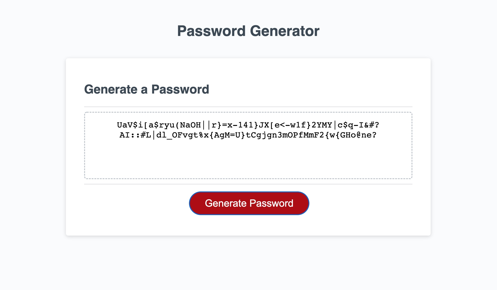

# Stepan's password-generator

> Password generator project. A website with a password generator.
> Live demo [_here_](https://elfsvet.github.io/stepan-matysik-password-generator/). 

## Table of contents
* [General info](#general-info)
* [Technologies](#technologies)
* [Setup](#setup)
* [Features](#features)
* [Screenshots](#screenshots)
* [Usage](#usage)
* [Project Status](#project-status)
* [Room for Improvement](#room-for-improvement)
* [Acknowledgements](#acknowledgements)
* [Contacts](#contact)


## General Info
This project is a webpage with a password generator box.
It provides a simple option of generating a password with certain criteria.

## Technologies
Project is created with:
- HTML
- CSS
- JavaScript

## Setup
To open this project in vscode using git in Terminal/Git Bash:

```
$ cd ../password-generator
$ git clone https://github.com/elfsvet/stepan-matysik-password-generator.git
$ code .
```

## Features
- You can specify exactly what sort of password you want to create
- Generating password only with one type of parameters
- Supports the generation of passwords up to 128 characters long
## Screenshots



## Usage
For easy creation different types of password from 8 to 128 characters in length.

## Project Status
Project is: _complete_

## Room for Improvement
To do:
- We can ask how many characters of specific type characters a user wants. (For example: 5 of Uppercase 3of lowercase 2 special characters...etc.)
- We can add a quick option to copy the result.

## Acknowledgements
- This project was inspired by UM Coding Boot Camp
- This project was using [this starter code](https://github.com/coding-boot-camp/friendly-parakeet)

## Contact
Created by [@elfsvet](https://github.com/elfsvet)
- [LinkedIn](https://www.linkedin.com/in/stepanmatysik/)
